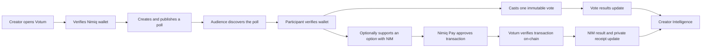

<div align="center">

# Votum

### Put NIM behind your say.

**Verified voting and optional NIM support, built inside Nimiq Pay.**

Votum enables creators, organizations, communities, brands, and fanbases to publish a question, collect one immutable vote per verified wallet, and measure optional NIM support as a separate signal.

[Launch Votum](https://votum-five.vercel.app) · [How it works](https://votum-five.vercel.app/how-it-works) · [Explore polls](https://votum-five.vercel.app/explore)

**Built for the Nimiq Mini Apps Competition · Live on Nimiq mainnet**

</div>

---

## The idea

Most online polls measure clicks, not accountable participation.

They are easy to spam, repeat, brigade, or abandon. They also force creators to guess whether an audience merely preferred an option or cared enough to support the work behind it.

Votum separates those questions:

- **Votes measure breadth:** how many verified participants chose an option?
- **NIM support measures depth:** how much optional economic support did that option receive?

One never buys the other.

> **One verified wallet gets one vote. Sending more NIM never creates more voting power.**

This creates a more useful audience signal without turning a poll into a wager, a stake-weighted election, or a winner-takes-all pool.

---

## What Votum is

Votum is a **verified participation platform** delivered today as a Nimiq Pay Mini App.

The current product supports general-purpose polls that can be used for:

- product and roadmap decisions;
- creator and fan choices;
- community priorities;
- grant and ecosystem feedback;
- event and campaign selections;
- brand and customer research;
- sports predictions without pooled stakes or winner payouts;
- entertainment decisions such as episode, character, design, or release preferences.

The launch wedge is simple: create a poll, verify participants, record one vote per wallet, optionally accept direct NIM support, and show both signals clearly.

The larger vision is broader:

> **Any audience. Any question. One verified choice per participant.**

---

## V1 — live today

Votum is not a concept page or static prototype. The complete core loop is deployed and working in production.

| Product surface | Live implementation |
|---|---|
| Nimiq Pay integration | Official `@nimiq/mini-app-sdk` initialization and wallet-provider handling |
| Wallet verification | Cryptographic challenge signing with a 12-hour secure server session |
| Poll creation | Multi-step creation flow with two to six options, support purpose, recipient, minimum NIM, and duration |
| Drafts | Browser-local auto-save, recovery, reopening, and deletion |
| Publishing | Atomic, idempotent poll creation tied to the verified creator wallet |
| Discovery | Public Explore directory and shareable poll URLs |
| Creator ownership | My Polls is scoped to the verified creator session |
| Verified voting | One immutable vote per verified wallet, enforced by the database |
| NIM support | Native Nimiq Pay transaction approval through `sendBasicTransactionWithData` |
| On-chain confirmation | Server-side Nimiq PoS JSON-RPC verification before support is counted |
| Payment recovery | Pending-to-confirmed polling with refresh-safe transaction restoration |
| Replay protection | One transaction hash cannot be reused across support intents |
| Results | Vote totals, percentages, NIM totals, and support counts shown separately |
| Receipts | Private confirmed-support receipt tied to the initiating Votum session |
| Creator Intelligence | Total polls, votes, confirmed NIM, support counts, option performance, and recent activity |
| Activity centre | Creator notification bell with publication, vote, and confirmed-support events |
| Product education | Interactive Creator Flow, Voter Flow, and Fairness explanations |
| Responsive UX | Mobile-first experience designed for use inside Nimiq Pay |

---

## The end-to-end experience



### Creator flow

1. Open Votum inside Nimiq Pay.
2. Verify wallet ownership.
3. Write a question and add two to six meaningful options.
4. Explain what optional NIM support is for.
5. Set a minimum amount, duration, and disclosed recipient wallet.
6. Review the fairness rules and publish.
7. Track votes, confirmed NIM, option performance, and recent activity.

### Participant flow

1. Open a live poll from Explore or a shared link.
2. Verify a Nimiq wallet.
3. Select one option and cast one vote.
4. Optionally support an option with NIM.
5. Approve the transaction natively through Nimiq Pay.
6. Receive a confirmed receipt after on-chain verification.
7. See vote participation and NIM support as separate results.

---

## Why Nimiq Pay matters

Votum is designed around Nimiq Pay rather than treating the wallet as an external add-on.

- The Mini App SDK provides the client-side Nimiq environment.
- Wallet access is requested only after an explicit user action.
- Wallet ownership is proven with an official signed-message challenge.
- NIM support is approved through the native transaction experience.
- Transactions are verified against the Nimiq PoS network before public totals change.
- Votum continues to render outside Nimiq Pay and provides truthful guidance when wallet capabilities are unavailable.

### Initiator, payer, and recipient

Nimiq Pay may select a funding account different from the wallet that initiated the support flow. Votum therefore models three distinct roles:

- **Initiator wallet:** the verified Votum session that owns the private support intent and receipt;
- **Supporter wallet:** the actual on-chain transaction sender selected through Nimiq Pay;
- **Recipient wallet:** the disclosed poll destination that receives the NIM directly.

Recipient, amount, memo, network, execution result, and transaction hash are still verified strictly.

---

## Fairness model

Votum deliberately keeps voting power and money separate.

### One wallet · one vote

Each verified wallet can vote once in a poll. Votes are immutable after confirmation and the constraint is enforced at the database level, not only in the interface.

### NIM does not buy influence

Optional support can show conviction, but it does not increase:

- vote weight;
- number of votes;
- result percentage;
- creator permissions;
- future accuracy scores, streaks, or leaderboard rank.

### Direct, non-custodial support

NIM moves directly from the paying account to the poll’s disclosed recipient. Votum does not hold, escrow, pool, redistribute, or refund participant funds.

### No wagering mechanics

The current product has no odds, stake pool, losing side, payout redistribution, or winner reward funded by participants. Prediction-style polls are expressions of audience expectation, not prediction markets.

---

## Security and integrity

The product was built around server-enforced guarantees rather than client-side trust.

- Wallet ownership uses cryptographic challenge-response verification.
- Session tokens are stored in `HttpOnly` cookies and hashed server-side.
- Creator identity is derived from the verified server session.
- Poll publication is atomic and idempotent.
- One-wallet-one-vote is protected by database constraints.
- Support intents are private and session-bound.
- Transaction hashes are unique and protected from replay.
- NIM transactions are confirmed through server-side JSON-RPC checks.
- Recipient, sender, amount, memo, network, and execution status are validated.
- Pending transactions can resume after refresh without triggering a second payment.
- Duplicate confirmation loops are guarded so stale responses cannot overwrite a confirmed receipt.
- Supabase Row Level Security restricts public access to the intended published data.
- Private writes and sensitive records remain behind server APIs and service-role access.
- Votum never displays raw provider payloads or exposes wallet secrets.

---

## Creator Intelligence

Votum gives poll creators more than a final winning option.

The live `/insights` experience includes:

- total published polls;
- total verified votes;
- total confirmed NIM;
- confirmed support count;
- per-poll performance;
- option-level vote distribution;
- option-level NIM distribution;
- recent publication, vote, and support activity;
- direct links back to the relevant poll.

Votes and NIM are never merged into a single opaque score. Creators can see participation and economic support independently.

---

## Product architecture

```mermaid
flowchart TB
    NP[Nimiq Pay Mini App] --> UI[Next.js 16 / React 19]
    UI --> API[Next.js server routes]
    API --> DB[(Supabase PostgreSQL)]
    API --> RPC[Nimiq PoS JSON-RPC]
    UI --> SDK[@nimiq/mini-app-sdk]
    API --> CORE[@nimiq/core]
    DB --> RLS[Row Level Security]
    RPC --> VERIFY[Transaction verification]
```

### Technology

- **Framework:** Next.js 16 App Router
- **Interface:** React 19, TypeScript, Tailwind CSS v4, GSAP
- **Wallet:** `@nimiq/mini-app-sdk`
- **Server-side Nimiq cryptography:** `@nimiq/core`
- **Blockchain verification:** Nimiq PoS JSON-RPC
- **Database:** Supabase PostgreSQL
- **Authorization:** Row Level Security and service-role server access
- **Deployment:** Vercel
- **Network:** Nimiq mainnet, network ID `24`

---

## V2 — after the hackathon

V1 proves the trust, payment, and creator-intelligence foundation. V2 expands Votum from a Mini App poll product into a recurring participation network.

The roadmap is intentionally presented at product level. Implementation and scoring details remain private while they are being designed and tested.

### 1. Participation formats

Expand beyond standard choice polls into structured formats for:

- decisions;
- predictions and forecasts;
- rankings;
- nominations;
- fan selections;
- recurring poll series;
- scheduled and time-locked participation.

### 2. Public participation identity

Give participants a lasting record of meaningful activity through profiles, vote history, prediction accuracy, participation streaks, badges, and reputation.

### 3. Following and return loops

Allow users to follow creators, organizations, teams, topics, and poll series, then receive relevant notifications when participation opens, closes, or resolves.

### 4. Sports and entertainment experiences

Introduce templates and integrations for match predictions, player selections, fan awards, episode direction, character choices, release decisions, and other audience-led moments.

### 5. Shareable distribution

Add shareable poll cards, result cards, participation receipts, embeds, QR flows, and creator-facing distribution tools.

### 6. Organization and creator workspaces

Support public profiles, verified organizations, team access, recurring campaigns, moderation controls, richer audience segmentation, and advanced analytics.

### 7. Reputation and leaderboards

Build category, creator, competition, weekly, and seasonal leaderboards around consistent and accurate participation—not around how much NIM a user spends.

### 8. Sponsor-funded Votum Rewards

Explore transparent NIM rewards for eligible milestones and leaderboard performance, funded independently by Votum or sponsors.

The design guardrails are strict:

- participation remains free;
- user support is never pooled into a prize pot;
- losing users lose nothing;
- NIM support never buys points or rank;
- reward rules are published before a season begins;
- anti-farming, eligibility, and manual review come before automated payouts;
- legal and jurisdictional review is required before public real-value reward campaigns.

### 9. Easier mainstream onboarding

Reduce wallet friction for audiences unfamiliar with Web3 while preserving verifiable uniqueness and the one-participant-one-vote principle.

### 10. Platform distribution

Develop embeddable Votum components, creator APIs, partner integrations, multilingual experiences, and tools for publishers, brands, sports communities, and entertainment platforms.

---

## Product principles

Votum’s roadmap is governed by a few non-negotiable rules:

1. **Verification before vanity metrics.**
2. **One verified participant, one vote.**
3. **Support never buys voting power.**
4. **Votes and money remain separate signals.**
5. **Recipients and purposes are disclosed before payment.**
6. **Participant funds are never silently pooled or redistributed.**
7. **Every financial claim must match what the product actually executes.**
8. **Mainstream usefulness comes before Web3 terminology.**

---

## Current limitations

V1 keeps the surface intentionally focused:

- published polls cannot yet be edited or deleted;
- confirmed votes cannot be changed;
- drafts are stored locally and do not sync across devices;
- wallet verification is the current participation identity;
- there are no comments, follows, public profiles, or group workspaces yet;
- prediction outcomes are not yet automatically resolved or scored;
- there is no live streak, leaderboard, or reward system in V1;
- there are no custody, escrow, pooled-prize, or winner-payout mechanics;
- multi-language support is not yet available.

These are roadmap boundaries, not hidden claims about the current release.

---

## Run locally

### Prerequisites

- Node.js 18+
- npm
- Supabase project
- Nimiq Pay for full Mini App testing
- Nimiq PoS JSON-RPC endpoint for on-chain support verification

### Install

```bash
npm install
```

### Configure environment

Copy the example file:

```bash
cp .env.example .env.local
```

Required variables:

| Variable | Exposure | Purpose |
|---|---|---|
| `NEXT_PUBLIC_APP_URL` | Public | Canonical HTTPS application URL |
| `NEXT_PUBLIC_SUPABASE_URL` | Public | Supabase project URL |
| `NEXT_PUBLIC_SUPABASE_PUBLISHABLE_KEY` | Public | Supabase publishable key |
| `SUPABASE_SECRET_KEY` | Server only | Privileged server database access |
| `NIMIQ_RPC_URL` | Server only | Nimiq PoS JSON-RPC endpoint |
| `NIMIQ_NETWORK_ID` | Server only | `24` for Nimiq mainnet |

Never commit `.env.local`, service-role credentials, session cookies, wallet recovery material, or private keys.

### Apply database migrations

```bash
npx supabase db push
```

All database migrations live in `supabase/migrations/`.

### Start development

```bash
npm run dev
```

For testing from Nimiq Pay on the same local network:

```bash
npm run dev -- --hostname 0.0.0.0
```

### Production build

```bash
npm run build
npm run start
```

---

## Verification commands

```bash
npx tsc --noEmit
npm run lint
npm run build
npx tsx src/lib/nimiq/crypto-consistency.ts
node --env-file=.env.local --import tsx src/lib/api/publish-test.ts
node --env-file=.env.local --import tsx src/lib/api/vote-test.ts
node --env-file=.env.local --import tsx src/lib/support/support-regression-test.ts
```

The production build currently compiles 24 application routes.

---

## Production

- **Live application:** https://votum-five.vercel.app
- **How it works:** https://votum-five.vercel.app/how-it-works
- **Explore:** https://votum-five.vercel.app/explore
- **Network:** Nimiq mainnet (`24`)
- **Nimiq Pay deep link:** `nimiqpay://miniapp?url=votum-five.vercel.app`

---

## Repository documentation

- [`DESIGN.md`](DESIGN.md) — visual system and interface direction
- [`docs/brand-messaging.md`](docs/brand-messaging.md) — brand voice and product language
- [`docs/votum-product-idea.md`](docs/votum-product-idea.md) — original MVP thesis and scope
- [`supabase/migrations/`](supabase/migrations/) — database evolution and security rules

---

## Competition status

Votum V1 was built and submitted for the **Nimiq Mini Apps Competition**.

The hackathon release proves:

- a real Nimiq Pay Mini App experience;
- secure wallet ownership verification;
- database-enforced one-wallet-one-vote;
- native NIM support;
- on-chain transaction confirmation;
- refresh-safe receipts and replay protection;
- transparent, separate vote and NIM results;
- creator analytics and activity intelligence;
- a production deployment on Nimiq mainnet.

Development continues after the competition.

---

## License

Votum is released under the [MIT License](LICENSE).

---

<div align="center">

### Votum turns audience participation into accountable signal.

**Put NIM behind your say.**

</div>
